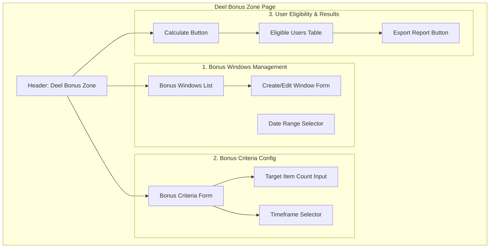
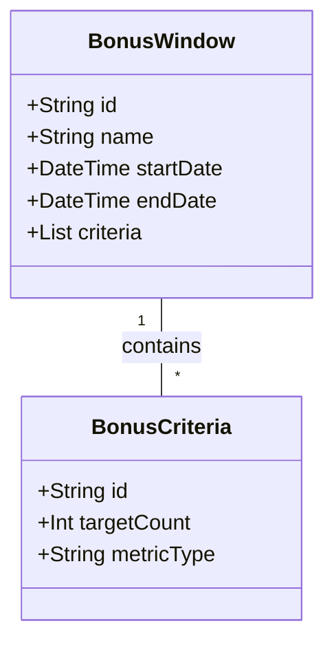

# Deel Bonus Zone

The **Deel Bonus Zone** is a dedicated administration page for managing bonus eligibility windows and criteria. This tool allows admins to define performance targets (e.g., number of items submitted) within specific timeframes and identify which users have met or exceeded these targets.

## Page Structure

The page is divided into three primary functional areas:

## Functional Flow

1.  **Configure Window**: Admins define when a bonus period starts and ends (e.g., "Q1 2026 Bonus").
2.  **Define Target**: Admins set the criteria for hitting the bonus, such as a minimum number of `DataRecord` items that must be associated with a user during that window.
3.  **Identify Users**: The system queries the `DataRecord` table, grouping by user and filtering by the window's date range.
4.  **Review & Export**: The results are displayed in a table showing users, their item counts, and their eligibility status. Admins can export this list for external processing.

## Proposed Data Model Additions

To support this page, the following models should be integrated into the Prisma schema:

